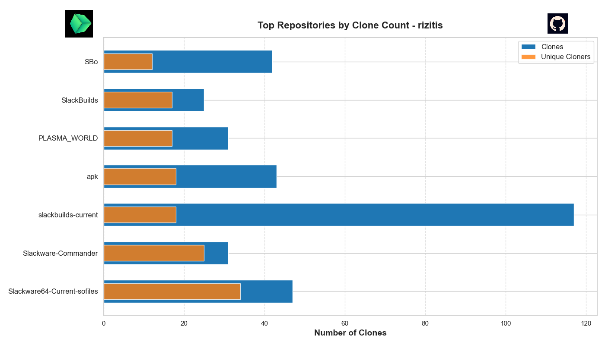

# CloneViz
Displays the clone statistics of my (yours) GitHub repositories. Repositories are also visualized in a graph
---

---

### Prepare

- clone this repo `https://github.com/rizitis/CloneViz.git`
- `pip install requests matplotlib seaborn pillow`
- create a hidden file `.token.txt` and write in your personal github token
- edit `fetch_clone_data.py` and replace my github user name `rizitis` with yours. 

### Run the scripts:

- `python3 fetch_clone_data.py`
- `python3 visualize_clones.py`

### Output

You now have 2 outputs. 
1. clone_stats.json 
2. the plot graph 

Use it as you like ;) 
